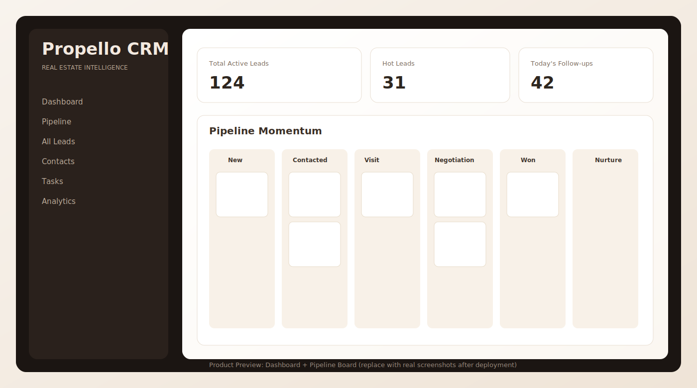
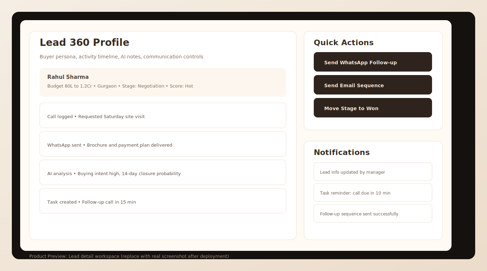
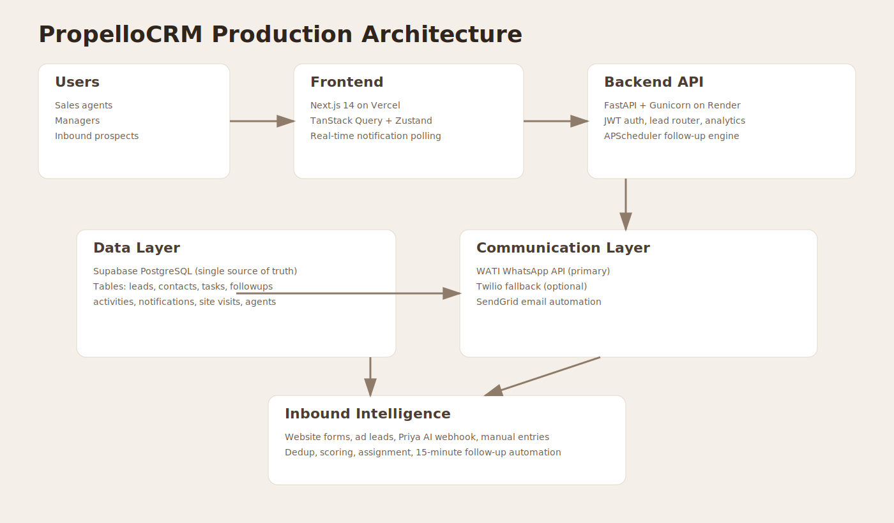
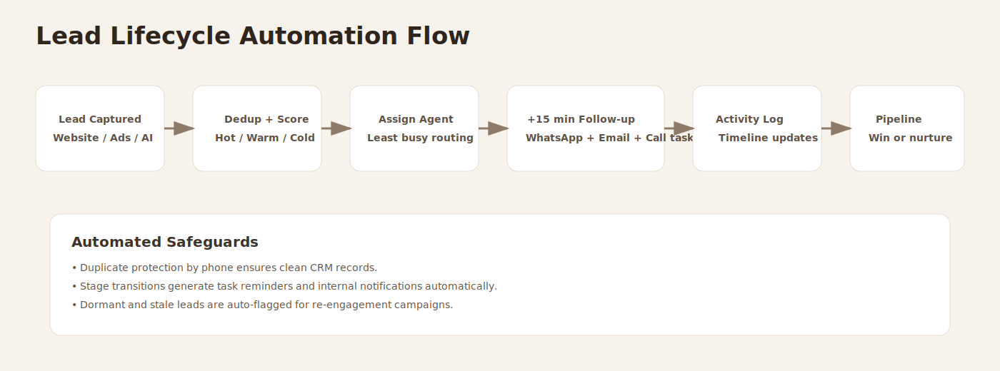
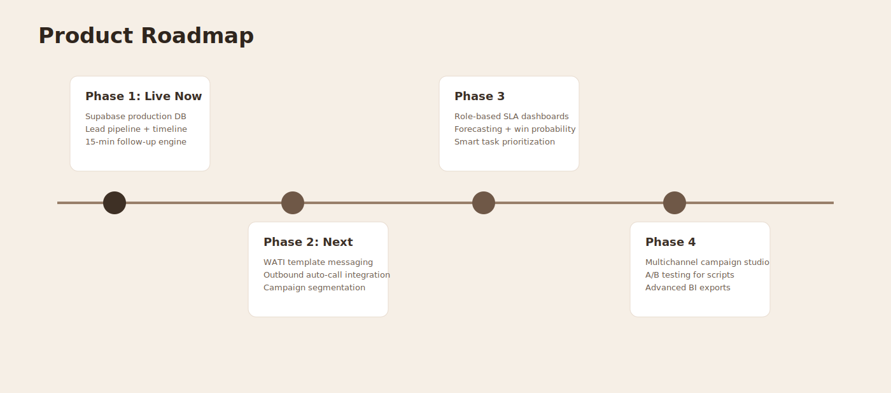

# PropelloCRM

Production-ready real estate revenue operating system built for fast-moving sales teams.

Repository: https://github.com/keshavmittal09/PropelloCRM.git

## Why PropelloCRM Exists

Most real estate teams lose deals because lead management is fragmented:

- Ad leads, website forms, calls, and walk-ins sit in different places.
- Follow-ups are inconsistent and often delayed.
- Managers cannot clearly see pipeline health or agent productivity.
- Customer context is lost between calls, visits, and negotiations.

PropelloCRM solves this by combining lead capture, AI-assisted workflows, multi-channel follow-up automation, and analytics into one production platform.

## What Problem It Solves

- Turns lead chaos into an actionable pipeline.
- Ensures no high-intent lead gets ignored.
- Reduces response-time gaps with automatic +15 minute follow-up actions.
- Gives managers real operational visibility with role-based dashboards.
- Creates a single source of truth on Supabase PostgreSQL.

## USP and Competitive Advantage

1. Supabase-first production architecture with cloud-native Postgres (not local-file DB).
2. Practical sales workflow automation: WhatsApp + email + call task orchestration.
3. AI-era lead intelligence design: activity timelines, memory briefs, and priority scoring.
4. Built for execution speed: easy deployment to Render and Vercel.
5. Built for scale: advanced modules plug into the same architecture without re-platforming.

## Product Visuals

### 1. Dashboard and Pipeline Experience

### 2. Lead 360 Workspace

### 3. Production Architecture

### 4. Lead Lifecycle Automation

### 5. Roadmap Snapshot

## Core Feature Set

### Lead Management

- Unified lead ingestion from multiple channels.
- Duplicate prevention based on phone identity.
- Kanban pipeline across full sales lifecycle.
- Lead scoring and priority tracking.
- Context-rich timeline with all interactions.

### Automation Engine

- Automatic follow-up sequence for new leads.
- +15 minute orchestration after lead generation.
- Automatic reminders, stale-lead handling, and task-overdue checks.
- Triggered notifications for key lead and task state changes.

### Communication Layer

- WhatsApp automation through WATI API (primary).
- Twilio fallback support for WhatsApp transport.
- SendGrid email integration support for follow-up messaging.
- Call workflow support through automatic task creation.

### Operations and Analytics

- Funnel metrics by stage.
- Source-level conversion visibility.
- Agent performance and workload views.
- Task planning through daily and overdue queues.

### Security and Access

- JWT-based authentication.
- Role-aware access behavior for agents and managers/admins.
- Supabase-backed persistence for production data durability.

## Technology Stack

| Layer | Technology |
|---|---|
| Frontend | Next.js 14, React, Tailwind CSS |
| Backend | FastAPI, SQLAlchemy 2 async |
| Database | Supabase PostgreSQL |
| Auth | JWT with python-jose + bcrypt |
| Jobs | APScheduler |
| Messaging | WATI API with Twilio fallback |
| Email | SendGrid integration path |
| Deployment | Vercel (frontend) + Render (backend) |

## Current Production Architecture

1. Frontend sends authenticated API requests to backend.
2. Backend handles lead processing, automation, and analytics.
3. Supabase stores all CRM entities in public schema.
4. Scheduler executes periodic operational jobs.
5. Communication providers handle outbound engagement.

## Data Model Summary

Primary entities:

- agents
- contacts
- leads
- activities
- tasks
- followups
- site_visits
- notifications
- properties

This schema supports end-to-end lead lifecycle traceability.

## Product Rollout Model

PropelloCRM is structured for immediate launch with a clear expansion path.

Live Product Capabilities:

- Unified CRM operations dashboard.
- Multi-channel lead ingestion and tracking.
- Intelligent follow-up orchestration and reminders.
- Role-aware execution workflows for teams.

Upcoming Expansion Track:

- Enhanced WhatsApp template journeys and campaign controls.
- Outbound voice workflow integration.
- Predictive conversion intelligence and richer analytics modules.
- Advanced BI export and portfolio intelligence views.

## Maintainer Docs

Deployment and operator instructions are maintained separately for project owners:

- DEPLOYMENT_GUIDE.md
- backend/README.md
- frontend/README.md

## API Surface Overview

Authentication and user:

- POST /api/auth/login
- GET /api/auth/me

Lead operations:

- POST /api/leads/inbound
- GET /api/leads
- GET /api/leads/board
- GET /api/leads/{id}
- PATCH /api/leads/{id}
- PATCH /api/leads/{id}/stage
- GET /api/leads/{id}/timeline
- POST /api/leads/{id}/note
- POST /api/leads/{id}/call-log
- POST /api/leads/{id}/whatsapp

Operations and analytics:

- GET /api/tasks/today
- GET /api/analytics/summary
- GET /api/analytics/funnel
- GET /api/analytics/by-source
- GET /api/analytics/agent-performance

## Business Impact and ROI Narrative

Operational gains delivered by this workflow model:

1. Faster first response window.
2. Lower lead leakage rate.
3. Better stage progression discipline.
4. Manager clarity on bottlenecks.
5. Improved conversion through consistent follow-up behavior.

## Real-World Use Cases

1. Mid-size developer sales team managing inbound ad volume.
2. Multi-agent brokerage with strict SLA follow-ups.
3. Project launch campaign requiring rapid nurture and callback loops.
4. Founders needing one dashboard to monitor team execution health.

## Upcoming Feature Roadmap

### Near-Term

- WATI template message support for non-session delivery.
- Advanced trigger controls and campaign playbooks.
- Better notification center with categorization and actions.

### Mid-Term

- Auto-dialer and call result ingestion.
- Predictive scoring and closure probability engine.
- Team leaderboards and SLA breach analytics.

### Long-Term

- Full campaign studio with segmentation and A/B tests.
- Multi-project portfolio intelligence dashboards.
- Deeper AI copilot for objection handling suggestions.

## Repository Structure

- backend: API, domain models, scheduler, automation engine.
- frontend: CRM web app interface and state layer.
- docs/images: visual assets for README presentation.

## Contribution Guidelines

1. Create feature branch.
2. Implement changes with tests where relevant.
3. Keep API and UI contracts backward-compatible when possible.
4. Submit PR with migration and rollout notes.

## License

This repository currently follows the licensing terms configured by the owner.

## Final Note

This repository is positioned as a deployable sales operations platform with a defined roadmap for continuous capability upgrades.
